 
 Git Labels
==========

Git Labels is a google chrome extension that help users better manage grouped labels within their Github repository. This extension helps organize labels into different groups and restricts user's selection of labels based on label group exclusivity rules. It currently supports three different label group types and they are dot, dashed and non-grouped.

## Getting Started

These instructions will get you a copy of the project and run it as a Google Chrome Extension within Google Chrome on your local machine. See [wiki](https://github.com/GitHubExtensions/Git-Labels/wiki) for this project's developer notes.

### Prerequisites

```
Google Chrome Browser (Tested on version 59.0.3071.109) with javascript enabled
```

### Download

#### Direct Link

**[Click here to download latest version](https://github.com/GitHubExtensions/Git-Labels/archive/master.zip)**

#### Code on Github

The full git repository is at: <https://github.com/GitHubExtensions/Git-Labels> Get it using the following command:

        $ git clone https://github.com/GitHubExtensions/Git-Labels.git

### Installation

#### [**Option 1: Using packed google chrome extension**](#option-1-using-packed-google-chrome-extension)

1. **Download Git Labels**

    Download a [copy](#download) of the project onto your local machine and unzip its contents. Ensure that the root structure of your folder is as shown below:

    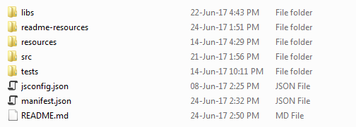
    
2. **Locate the Git-Labels.crx file**

   Navigate into the /bin/ directory from the root structure of your folder and locate the **Git-Labels.crx** file as shown below:

   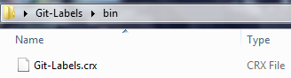

3. **Navigate to Chrome Extensions**

   Navigate to `chrome://extensions/` in Google Chrome
   
4. **Install Git-Labels packed extension**

   In order to install the packed extension, drag and drop the **Git-Labels.crx** file in the Chrome Extensions page as shown below:
   
   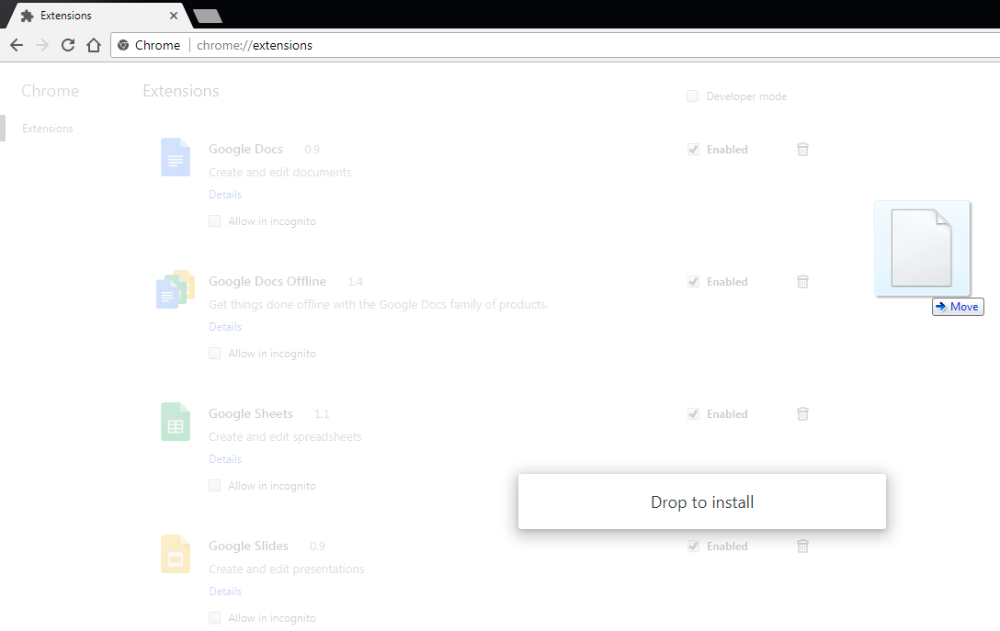
   
5. **Confirm installation**

   To confirm the installation of the extension, click on the Add extension button as shown below :
   
   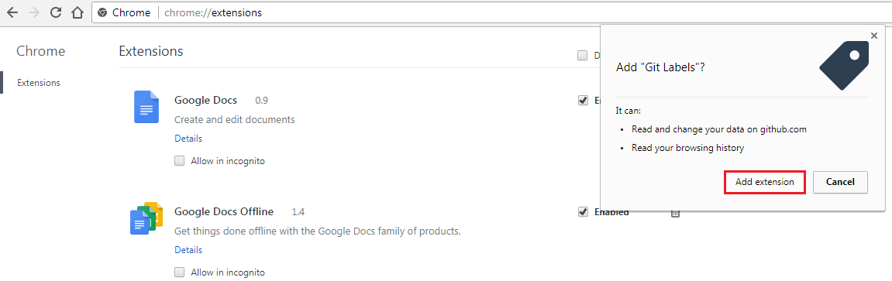
   
6. **Verify installation**

   Ensure that after installing the extension, your Google Chrome extension page has an entry for Git Labels as shown below:

   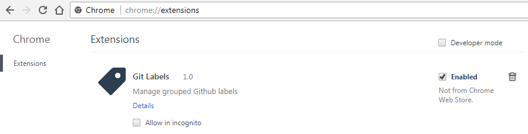

***

#### [**Option 2: From source**](#option-2-from-source)

1. **Download Git Labels**

    Download a [copy](#download) of the project onto your local machine and unzip its contents. Ensure that the root structure of your folder is as shown below:

    

2. **Navigate to Chrome Extensions**

    Navigate to `chrome://extensions/` in Google Chrome

3. **Enable Developer Mode**

    Tick on the checkbox with the words "Developer mode" on its right

    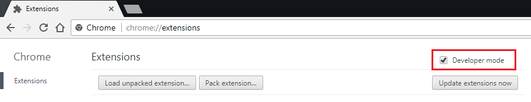

4. **Load unpacked extension**

    Click on the "Load unpacked extension..." button and select the folder containing the project. Ensure that after loading the extension, your Google Chrome extension page has an entry for Git Labels as shown below:

    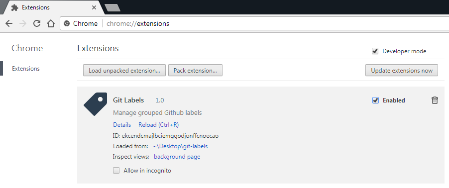
    
## Features
1. **Integrated into the page**

    You can launch Git Labels sidebar UI by pressing the 'l' key or by clicking on labels
    
    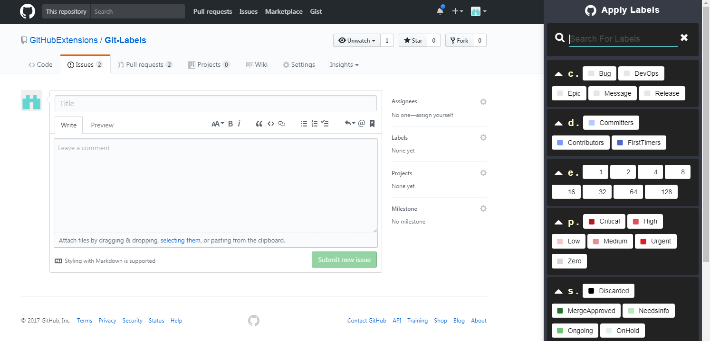

2. **Labels search**
    
    If you have many labels, Git Labels search will help you quickly find labels that you are looking for.

    

3. **Organize grouped labels**

    Labels are organized according to their groups (dot, dashed or non-grouped).

    

4. **Convenient label selection and unselection**

    Selected labels are displayed above the search bar for easy reference. Furthermore, the selection status of labels can be toggled on or off by clicking on those labels.
    
    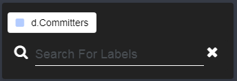
    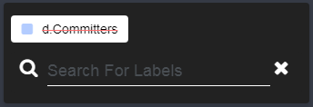

5. **Resolve conflicts among selected labels within exclusive groups**

    Git Labels will prevent any conflicts due to selection of labels from exclusive groups. Only one label within a exclusive group should be selected at any one time for an issue and thus selection of more than one label from such a group will result in a conflict. In the example below, d.FirstTimers and d.Contributors belong to the same group (i.e d dot group).

    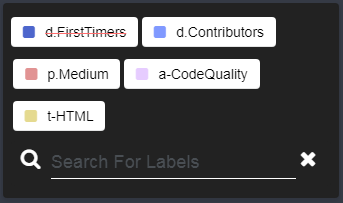

6. **Colorpicker**

    Instead of a fixed color palette, Git labels offers its users a colorpicker for selecting colors for newly created labels.

    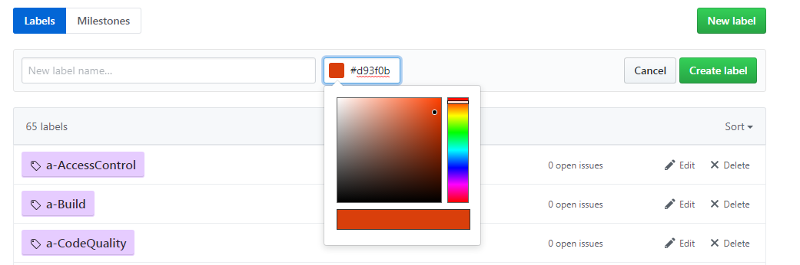

## Built With

jQuery - <https://github.com/jquery/jquery>

Semantic UI - <https://github.com/semantic-org/semantic-ui/>

PubSubJS - <https://github.com/mroderick/PubSubJS>

ScrollIntoView - <https://github.com/litera/jquery-scrollintoview>

Spectrum - <https://github.com/bgrins/spectrum>

## For Developers

See [wiki](https://github.com/GitHubExtensions/Git-Labels/wiki) for this project's developer notes.
